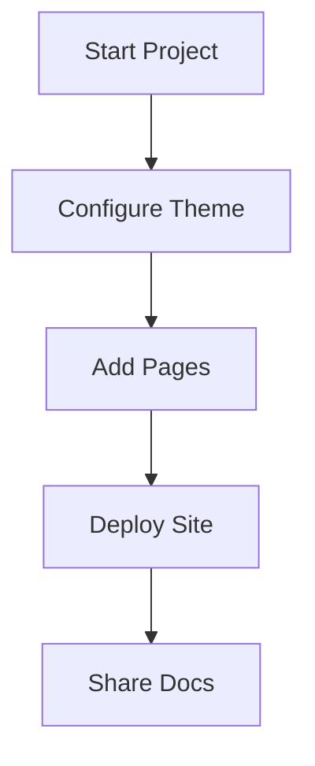

## Overview

Welcome to Abdelrahman Yousef Documentation, your default space for organizing and managing all project documentation. This platform provides a flexible environment where you create, edit, and publish docs using MDX. Customize it with your brand color, such as `#3B82F6`, to match your project's identity. Start by exploring the sidebar navigation to find guides, APIs, and changelogs.

## Key Benefits

You gain several advantages from this documentation space:

<Columns cols={3}>
  <Card title="Centralized Organization" icon="layout" href="/docs/organization">
    Keep all your project docs in one place. Use folders, tags, and search to navigate effortlessly.
  </Card>
  <Card title="MDX-Powered Content" icon="code" href="/docs/mdx-guide">
    Write rich content with components like `<Callout>` and `<Steps>`. Embed code, diagrams, and interactive elements.
  </Card>
  <Card title="Custom Branding" icon="palette" href="/docs/customization">
    Apply your brand color `{primary: '#3B82F6'}` across the site for a professional look.
  </Card>
</Columns>

## Getting Oriented

Follow these steps to familiarize yourself with the platform:

<Steps>
  <Step title="Explore Navigation" icon="menu">
    Use the left sidebar to access pages. Click "Docs" for core guides and "API" for endpoints.
  </Step>
  <Step title="Create Your First Page" icon="plus">
    Go to the dashboard and select "New Page". Choose `introduction.mdx` as your template.

    <CodeGroup tabs="CLI,UI">
      ```bash
      npx create-docspace@latest my-project
      cd my-project
      npm run dev
      ```
      ```typescript
      // config/theme.ts
      export const theme = {
        colors: { primary: '#3B82F6' }
      };
      ```
    </CodeGroup>
  </Step>
  <Step title="Preview Changes" icon="eye">
    Edit files in your editor and watch live previews. Deploy with `npm run build`.
  </Step>
</Steps>

<Callout kind="tip">
  Enable dark mode in your settings for better coding sessions. Toggle it via the user menu.
</Callout>

## Customization Options

Tailor the platform to your needs using these methods:

<Tabs>
  <Tab title="Brand Colors" icon="palette">
    Update your theme configuration to set the primary color.

    ```typescript
    // theme.config.ts
    export default {
      color: {
        primary: '#3B82F6',  // Abdelrahman Yousef blue
        secondary: '#1E40AF'
      }
    };
    ```

    Restart your dev server to apply changes.
  </Tab>
  <Tab title="Navigation" icon="menu">
    Edit `nav.config.ts` to reorder sidebar items.

    ```typescript
    // nav.config.ts
    export const nav = [
      { title: 'Overview', href: '/introduction' },
      { title: 'Guides', href: '/guides' },
      { title: 'API', href: '/api' }
    ];
    ```
  </Tab>
  <Tab title="Components" icon="components">
    Extend with custom MDX components in `components/`.

    <Expandable title="Advanced Usage" default-open="false">
      Import your component:

      ```jsx
      import { CustomButton } from './components/CustomButton';

      <CustomButton variant="primary">Click Me</CustomButton>
      ```
    </Expandable>
  </Tab>
</Tabs>

## Next Steps

<Columns cols={2}>
  <Card title="Quickstart Guide" icon="rocket" href="/docs/quickstart">
    Set up your first project in under 5 minutes.
  </Card>
  <Card title="API Reference" icon="api" href="/docs/api">
    Integrate with endpoints using realistic examples.
  </Card>
</Columns>



This setup ensures you maintain organized, branded documentation that scales with your project.