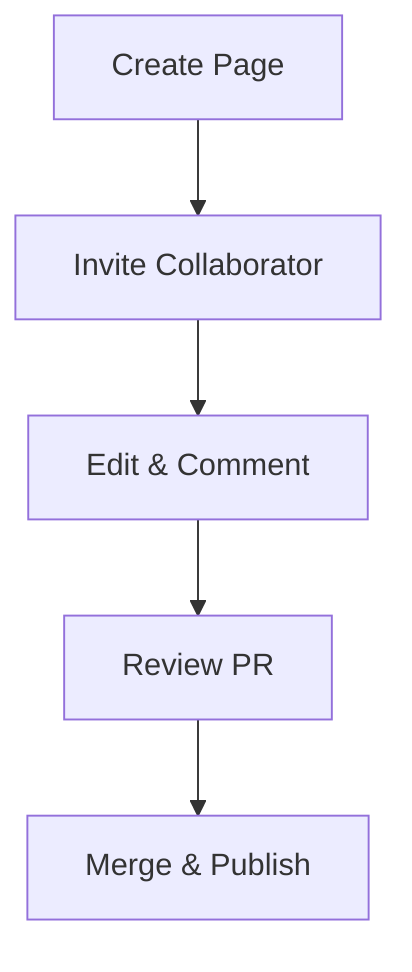

## Overview

You manage your abdelrahman yousef Documentation space by creating pages, organizing hierarchies, integrating version control, and enabling collaboration. This guide walks you through each process with practical steps and examples. Start by familiarizing yourself with the editor interface, then build a structured documentation site.

<Columns cols={3}>
  <Card title="Create Pages" icon="file-plus" href="#creating-pages">
    Build new documentation pages quickly.
  </Card>
  <Card title="Organize Hierarchy" icon="folder" href="#hierarchy">
    Structure your content for easy navigation.
  </Card>
  <Card title="Collaborate" icon="users" href="#collaboration">
    Work with your team seamlessly.
  </Card>
</Columns>

## Creating and Editing Pages

Use the built-in editor to create and modify pages. Follow these steps to get started.

<Steps>
  <Step title="Create a New Page" icon="plus">
    Navigate to your documentation root. Click the `New Page` button and enter a filename like `quickstart.mdx`. The editor opens automatically.
  </Step>
  <Step title="Edit Content" icon="edit-3">
    Write in Markdown or MDX. Add frontmatter at the top:

    ```yaml
    ---
    title: Quickstart Guide
    description: Get started in minutes.
    ---
    ```

    Use headings starting with `##` for sections.
  </Step>
  <Step title="Preview and Publish" icon="eye">
    Click `Preview` to see live changes. Save with `Ctrl+S` (<kbd>Ctrl</kbd>+<kbd>S</kbd>) to publish instantly.
  </Step>
</Steps>

<Callout kind="tip">
  Always include YAML frontmatter in every `.mdx` file for proper metadata rendering.
</Callout>

## Organizing Content Hierarchy

Structure your docs with folders and frontmatter to create a navigable sidebar. Use `_sidebar.mdx` or directory nesting.

| Level | Method | Example Path |
|-------|--------|--------------|
| Root | Index page | `index.mdx` |
| Section | Folder | `guides/quickstart.mdx` |
| Subsection | Nested folder | `api/v1/endpoints.mdx` |

For complex hierarchies, define links in `_sidebar.mdx`:

````mdx
```mdx
# Sidebar Configuration
- label: "Guides"
  href: "/guides"
  collapsed: false
  items:
    - label: "Quickstart"
      href: "/guides/quickstart"
```
````

<Expandable title="Advanced Hierarchy Tips" default-open="false">
  Avoid deep nesting beyond three levels. Use `href` for external links and `collapsed` to control expansion.
</Expandable>

## Version Control Basics

Integrate Git for tracking changes. Connect your repo via platform settings.

<CodeGroup tabs="Git Bash,CLI">
  ```bash
  git init
  git add .
  git commit -m "Initial docs commit"
  git remote add origin https://github.com/abdelrahman-yousef/docs.git
  git push -u origin main
  ```
  ```bash
  # Clone existing repo
  git clone https://github.com/abdelrahman-yousef/docs.git
  cd docs
  git pull origin main
  ```
</CodeGroup>

<Callout kind="info">
  Enable GitHub integration in settings to auto-sync commits with your live docs.
</Callout>

## Collaboration Features

Invite team members and manage permissions.

<Tabs>
  <Tab title="Invite Users" icon="user-plus">
    Go to `Settings > Team`. Enter emails and assign roles: `Editor` (edit pages), `Viewer` (read-only), or `Admin` (full access).

    Changes appear in real-time for all editors.
  </Tab>
  <Tab title="Review Changes" icon="git-pull-request">
    Use the `History` tab on any page to compare versions. Approve or revert via Git pull requests linked to your repo.
  </Tab>
  <Tab title="Comments" icon="message-circle">
    Highlight text and add inline comments. @mention users for notifications: `@team review this section`.
  </Tab>
</Tabs>



Your documentation stays organized and up-to-date with these tools. Regularly commit changes and review contributions to maintain quality.